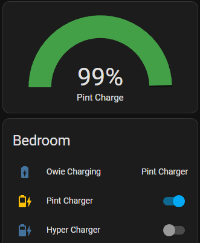
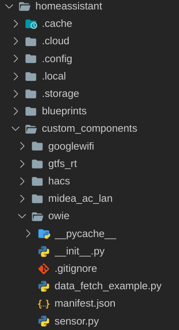

For this integration you need a Onewheel with OWIE chip up to v1.4.3 confirmed working. OWIE will need to be able to connect to the same network as Home Assistant and be assigned static IP which will be used in the yaml.

Owie Integration in use:

At the moment this integration creates:

A battey sensor

A charging sensor:
    With an aditional attribute for charge rate between balance charging / Pint / XR / Hypercharger based on charging amperage.

<!-- Soon:
Add owie config to HACS for easy install and update

A cell balance sensor:

A Energy use sensor:

Example Automations:

Turn off charger at 90% if cells are balanced: -->

How to install:

Download this github and copy the owie folder into your Home Assistant 'custom_components' folder.

Then add the owie platform to your Home Asistant config using the following below:

Config Yaml Use:
    
    sensor:
    - platform: owie
        name: "Owie Pint"        
        owie_local_ip: 127.0.0.1 #Owie IP Address
